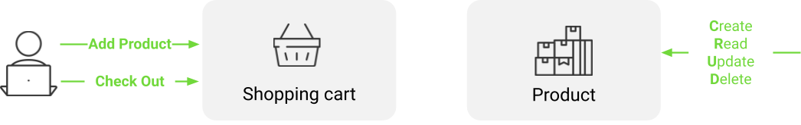
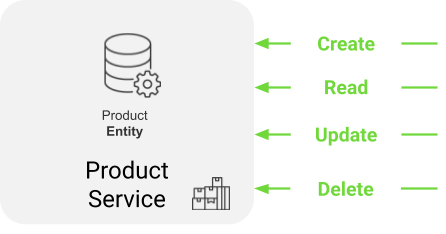
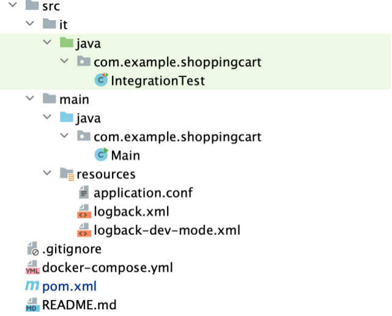

# Prerequisite
Java 17 or later<br>
Maven 3.6 or later<br>
Docker 20.10.14 or higher (to run locally)<br>
# Introduction

If you have gone through the `Explore Kalix Virtaully` journey, you are all set to :
- [Run locally in prod-like environment](#run-locally-in-prod-like-environment) <br>
- [Deploy and run on Kalix Platform on Cloud Provider of your choice ](deploy-and-run-on-kalix-platform-on-cloud-provider-of-your-choice)

However, if you would like to better understand the `Kalix Developer Experience` and how to build applications on Kalix, here is more details on the same-use.    
# Kalix Trial - eCommerce - Java
## Designing Kalix Services
### Use case 
<br>
eCommerce use case is a simple shopping cart example consisting of product stock and shopping cart.
Product stock models stock (simple quantity) of products that are being sold and Shopping Cart models list of products customer intends to buy.<br>
In this exercise focus is on implementing Product Stock functionalities
#### Product Stock
Data model:
- quantity

**Note**: Product stock data model does not hold the productId because the HTTP/REST API is designed around productId itself. 
Operations:
- CREATE/READ/UPDATE/DELETE product stock

### Kalix components
Kalix components serve to abstract functionalities.<br> 
In this particular use case, we will utilize a Kalix component known as `Entity`.<br>
<br>
Entity:
- component for modeling of data and data business logic operations
- removes complexities around data:
  - caching
  - concurrency
  - distributed locking
- simplifies data modeling, business logic implementation with out-of-the box scalability, resilience
Kalix provides other components that are not used in this use case and more details can be found in [Kalix documentation](https://docs.kalix.io/):<br>
<br>

### Design Product Stock Kalix service
**Product Stock Service**
- implements Product Stock functionalities
- Kalix component used: Entity



**ProductStock Entity**
- models one product stock instance and business logic operations over that one instance

**Data model**
- quantity

**API**
- HTTP/RES
- Endpoints:
  - **Create**
    `POST /product-stock/{productId}/create`
    
    Request (JSON):
    - quantity (int)
    
    Response (String): "OK"
  - **Read**
    `GET /product-stock/{productId}/get`
    Request (JSON): No body
    
    Response (JSON):
    - quantity (int)
  - **Update**
    `PUT /product-stock/{productId}/update`
  
    Request (JSON):
    - quantity (int)
  
    Response (String): "OK"
  - **Delete**
    `DELETE /product-stock/{productId}/delete`
  
    Request (JSON): No body
  
    Response (String): "OK"

## Kickstart Kalix development project
### Kalix Maven ArchType
Kalix [Maven ArchType](https://maven.apache.org/archetype/index.html) generates a new Maven development project from Kalix template
### Create shopping cart Maven project from Kalix template 
Execute in command line:
```
mvn archetype:generate \
  -DarchetypeGroupId=io.kalix \
  -DarchetypeArtifactId=kalix-spring-boot-archetype \
  -DarchetypeVersion=1.3.7
```
Use this setup:
```
Define value for property 'groupId': com.example
Define value for property 'artifactId': kalix-trial-shoppingcart
Define value for property 'version' 1.0-SNAPSHOT: :
Define value for property 'package' com.example: : com.example.shoppingcart
```
Maven ArchType generates Maven project:



- `pom.xml` with all pre-configured Maven plugins and dependencies required development, testing and packaging of Kalix service code
- `Main`, Java Class for bootstrapping Kalix service
- `resources` directory with minimal required configuration
- `it` directory with integration test example

## Define data structure
Create ProductStock `Java record` in `com.example.shoppingcart package`.<br> 
Add helper methods for creating `empty` product stock structure and to validate if `isEmpty`.
```
public record ProductStock(Integer quantity){
    public static ProductStock empty(){
        return new ProductStock(null);
    }
    @JsonIgnore
    public boolean isEmpty(){
        return quantity == null;
    }
}

```
## Define API - Product Stock Entity API
1. Create `ProductStockEntity` Java class in `com.example.shoppingcart` package that `extends` `kalix.javasdk.valueentity.ValueEntity` with inner type `ProductStock` type
2. Add `productId` class parameter
3. Add constructor for Kalix to inject `ValueEntityContext` from which `entityId` is used set `productId`
4. Annotate `ProductStockEntity` class with spring web bind annotation `@RequestMapping` and configure path with `productId` as in-path parameter
5. Annotate class with `@Id("productId")` to configure parameter `productId` as the entity key
6. Annotate class with `@TypeId("product-stock")` to assign reference name to the entity
7. Override `emptyState` method and return `empty` `ProductStock` value

```
@Id("productId")
@TypeId("product-stock")
@RequestMapping("/product-stock/{productId}")
public class ProductStockEntity extends ValueEntity<ProductStock>{
    private final String productId;
    public ProductStockEntity(ValueEntityContext context) {
            this.productId = context.entityId();
    }
    @Override
    public ProductStock emptyState() {
       return ProductStock.empty();
    }
}

```
8. Annotate `ProductStockEntity` class with spring web bind annotation `@RequestMapping` and configure path with `productId` as in-path parameter
9. For each endpoints:
   - To `ProductStockEntity` class add method per endpoint (`create`, `get`, `update`, `delete`)
   - Each method:
     - input: HTTP request data structure (using spring web annotations)
     - return: `ValueEntity.Effect`  with HTTP response data structure as an inner type
     - using spring web annotation mappings for REST method and path mapping (`@PostMapping`,...)
```
@Id("productId")
@TypeId("product-stock")
@RequestMapping("/product-stock/{productId}")
public class ProductStockEntity extends ValueEntity<ProductStock>{
   private final String productId;
   public ProductStockEntity(ValueEntityContext context) {
   		this.productId = context.entityId();
   }
   @Override
   public ProductStock emptyState() {
     return ProductStock.empty();
   }
   @PostMapping("/create")
   public Effect<String> create(@RequestBody ProductStock productStock){}
   @GetMapping("/get")
   public Effect<ProductStock> get(){}
   @PutMapping("/update")
   public Effect<String> update(@RequestBody ProductStock productStock){}
   @DeleteMapping("/delete")
   public Effect<String> delete(){}
}

```
## Implementing business logic
Helper methods from `ValueEntity` class:
- `currentState()` facilitates access to current value of the data for that product stock instance (e.g. productId: 111)
- `effects()` facilitates actions that Kalix needs to perform
- `updateState()` - to persist data
- `thenReply()` - to send response after persistence is successful
- `error()` - to send error response back
- Kalix ensures that each method (create, get, update, delete) is executed in sequence for one product stock instance (e.g. productId: 111) ensuring consistency and resolving concurrent access.

### `create` endpoint
Business logic for create is to persist product stock data if not yet exists. In other cases returns an ERROR. 
```
@PostMapping("/create")
public Effect<String> create(@RequestBody ProductStock productStock){
   if(currentState().isEmpty())
       return effects().updateState(productStock).thenReply("OK");
   else
       return effects().error("Already created");
}
```
### `get` endpoint
Business logic for get is to product stock data if exists and if not return not found error.
```
@GetMapping("/get")
public Effect<ProductStock> get(){
   if(currentState().isEmpty())
       return effects().error("Not found", Status.Code.NOT_FOUND);
   else
       return effects().reply(currentState());
}

```
### `update` endpoint
Business logic for update is to update product stock data if product was already created. If product is not found, return NOT FOUND error.
```
@PutMapping("/update")
public Effect<String> update(@RequestBody ProductStock productStock){
   if(currentState().isEmpty())
       return effects().error("Not found", Status.Code.NOT_FOUND);
   else
       return effects().updateState(productStock).thenReply("OK");
}

```
### `delete` endpoint
Business logic for delete is delete data if product stock exists and return NOT FOUND error if not. 
Here the soft delete is done by `emptying` the Product Stock.
```
@DeleteMapping("/delete")
public Effect<String> delete(){
   if(currentState().isEmpty())
       return effects().error("Not found", Status.Code.NOT_FOUND);
   else
       return effects().updateState(ProductStock.empty()).thenReply("OK");
}

```
## Test
Kalix comes with very rich test kit for unit and integration testing of Kalix code

`Test kit` provides help (custom assertions, mocks,...) with:
- unit testing of individual Kalix components (e.g `Entity`) in isolation
- integration testing in Kalix Platform simulated environment in isolation

- Allows easy test automation with very high test coverage

### Unit test
1. Create a new `test/java` directories in `src` directory
2. Create `com.example.shoppingcart` package in `test/java`
3. Create `ProductStockEntityTest` class created package
4. Create `testCreate` method with `JUnit Jupiter Test` annotation
5. `ValueEntityTestKit` class is used for unit testing `Value Entity` component. Inner types are `ProductStock` and `ProductStockEntity`. 
    It is for unit testing one product instance so `productId` needs to be provided
6. `Testkit` call method is used for triggering each entity endpoint and result is `ValueEntityResult` with inner type as a HTTP result  
7. result can be used for test assertion
   - `isError` - assert error
   - `getReply` - assert reply
   - `getUpdatedState` - assert persistent data
```
public class ProductStockEntityTest {
   @Test
   public void testCreate()throws Exception{
       var productId = UUID.randomUUID().toString();
       ProductStock productStock = new ProductStock(10);

       ValueEntityTestKit<ProductStock, ProductStockEntity> testKit = ValueEntityTestKit.of(productId, ProductStockEntity::new);

       ValueEntityResult<String> res = testKit.call(entity -> entity.create(productStock));
       assertFalse(res.isError());
       assertEquals("OK",res.getReply());
       ProductStock persistedProductStock = (ProductStock)res.getUpdatedState();
       assertEquals(productStock.quantity(),persistedProductStock.quantity());
   }
}

```
Run the unit test:
```
mvn test
```
### Integration test
Kalix test kit for integration testing runs code using test containers to simulate Kalix Platform runtime environment.
Integration test uses spring reactive WebClient to interact with running code.
IntegrationTest class is created during development project kick start and is pre-configured with WebClient
Each endpoint is tested from the client perspective
```
public class IntegrationTest extends KalixIntegrationTestKitSupport {
 @Autowired
 private WebClient webClient;
 private Duration timeout = Duration.of(5, ChronoUnit.SECONDS);
 @Test
 public void test() throws Exception {
   var productId = UUID.randomUUID().toString();
   ProductStock productStock = new ProductStock(10);
   var res = webClient.post()
               .uri("/product-stock/%s/create".formatted(productId))
               .bodyValue(productStock)
               .retrieve()
               .toEntity(String.class)
               .block(timeout);
   var getProductStock = webClient.get()
           .uri("/product-stock/%s/get".formatted(productId))
           .retrieve()
           .toEntity(ProductStock.class)
           .block(timeout)
           .getBody();
   assertEquals(productStock.quantity(),getProductStock.quantity());
 }
}
```
Run the integration test:
```
mvn -Pit verify
```
### Run locally in prod-like environment
Run Kalix service locally:
```
mvn kalix:runAll
```
This command runs the Kalix service locally and exposes it on `localhost:9000`.
#### Test
Testing using `CURL`:
1. Create product:
```
curl -XPOST -d '{ 
  "quantity": 10
}' http://localhost:9000/product-stock/apple/create -H "Content-Type: application/json"
```
Result:
```
"OK"
```
2. Get product:
```
curl -XGET http://localhost:9000/product-stock/apple/get
```
Result:
```
{"quantity":10}
```
3. Update product:
```
curl -XPUT -d '{
"quantity": 20
}' http://localhost:9000/product-stock/apple/update -H "Content-Type: application/json"
```
Result:
```
"OK"
```
4. Delete product:
```
curl -XDELETE http://localhost:9000/product-stock/apple/delete
```
Result:
```
"OK"
```
### Deploy and run on Kalix Platform on Cloud Provider of your choice 
1. Install Kalix CLI
https://docs.kalix.io/setting-up/index.html#_1_install_the_kalix_cli
2. Kalix CLI 
   1. Register (FREE)
    ```
    kalix auth signup
    ```
    **Note**: Following command will open a browser where registration information can be filled in<br>
   2. Login
    ```
    kalix auth login
    ```
    **Note**: Following command will open a browser where authentication approval needs to be provided<br>

   3. Create a project
    ```
    kalix projects new kalix-trial-java-ecommerce --region=gcp-us-east1 --organization=my-organization
    ```
    **Note**: `gcp-is-east1` is currently the only available region for deploying trial projects. For non-trial projects you can select Cloud Provider and regions of your choice<br>

   4. Authenticate local docker for pushing docker image to `Kalix Container Registry (KCR)`
    ```
    kalix auth container-registry configure
    ```
    **Note**: The command will output `Kalix Container Registry (KCR)` path that will be used to configure `dockerImage` in `pom.xml`<br>
   5. Extract Kalix user `username`
   ```
   kalix auth current-login
   ```
   **Note**: The command will output Kalix user details and column `USERNAME` will be used to configure `dockerImage` in `pom.xml`<br>
3. Configure `dockerImage` path in `pom.xml`
Replace `my-docker-repo` in `dockerImage` in `pom.xml` with: <br>
`Kalix Container Registry (KCR)` path + `/` + `USERNAME` + `/kalix-trial-java-ecommerce`<br>
**Example** where `Kalix Container Registry (KCR)` path is `kcr.us-east-1.kalix.io` and `USERNAME` is `myuser`:<br>
```
<dockerImage>kcr.us-east-1.kalix.io/myuser/kalix-trial-java-ecommerce/${project.artifactId}</dockerImage>
```
4. Deploy service in Kalix project:
 ```
mvn deploy kalix:deploy
 ```
This command will: 
- compile the code
- execute tests
- package into a docker image
- push the docker image to Kalix docker registry
- trigger service deployment by invoking Kalix CLI
5. Check deployment:
```
kalix service list
```
Result:
```
kalix service list                                                                         
NAME                                         AGE    REPLICAS   STATUS        IMAGE TAG                     
kalix-trial-shoppingcart                     50s    0          Ready         1.0-SNAPSHOT                  
```
**Note**: When deploying service for the first time it can take up to 1 minute for internal provisioning
#### Proxy connection to Kalix service via Kalix CLI
1. Proxy connection to Kalix service via Kalix CLI
```
kalix service proxy kalix-trial-shoppingcart
```
Proxy Kalix CLI command will expose service proxy connection on `localhost:8080`.
#### Test
Testing using `CURL`:
1. Create product:
```
curl -XPOST -d '{ 
  "quantity": 10
}' http://localhost:8080/product-stock/apple/create -H "Content-Type: application/json"
```
Result:
```
"OK"
```
2. Get product:
```
curl -XGET http://localhost:8080/product-stock/apple/get
```
Result:
```
{"quantity":10}
```
3. Update product:
```
curl -XPUT -d '{
"quantity": 20
}' http://localhost:8080/product-stock/apple/update -H "Content-Type: application/json"
```
Result:
```
"OK"
```
4. Delete product:
```
curl -XDELETE http://localhost:8080/product-stock/apple/delete
```
Result:
```
"OK"
```